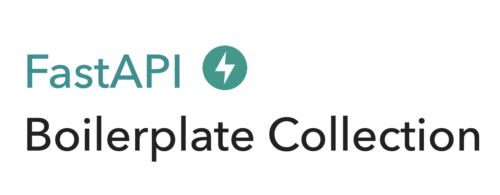

### Introduction

This is a **collection of FastAPI boilerplate** which made by [weekwith.me](https://www.weekwith.me) :rocket:  

You can read a specification of each boilerplate in [Website](https://fastapi.weekwith.me).  

A directory, `Repository` is a set of all boilerplates. It is specified by number and it includes all the source code. You can clone a specific boilerplate by using `branch`.

### List of Boilerplate

Here is a list of boilerplates.  
 
* **Directory** : which includes source code.
* **Description** : A short description of boilerplate. You can move to specification of it by click.
* **Branch** : You can clone a specific boilerplate by branch.
* **Status** :
    * :white_check_mark: which means **Complete**
    * :construction: which means **Work In Progress**
    * :see_no_evil: which means **Not Start**  

> :warning: **warning**
> 
> If you don't know how to use git command, `branch`, check [Clone a specific boilerplate](https://fastapi.weekwith.me/#clone-a-specific-boilerplate)

|Directory|Description|Branch|Status|
|:-------:|:--------:|:-----:|:----:|
|[01](./Repository/01/)|[Simple synchronous RESTful API](https://fastapi.weekwith.me/simple-synchronous-restful-api/)|`simple-synchronous-restful-api`|:construction:|
|[02](./Repository/02/)|[Simple asynchronous RESTful API](https://fastapi.weekwith.me/simple-asynchronous-restful-api/)|`simple-asynchronous-restful-api`|:construction:|

### Issues

You can use [Issues](https://github.com/0417taehyun/fastapi-boilerplate/issues) to ask about boilerplate or report some issues.